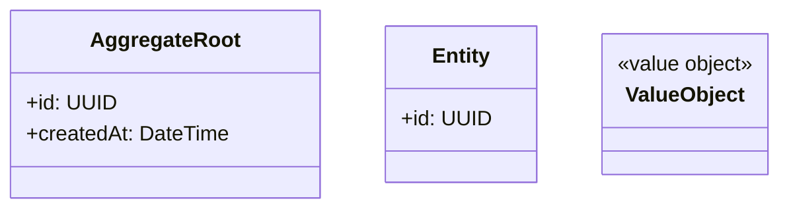
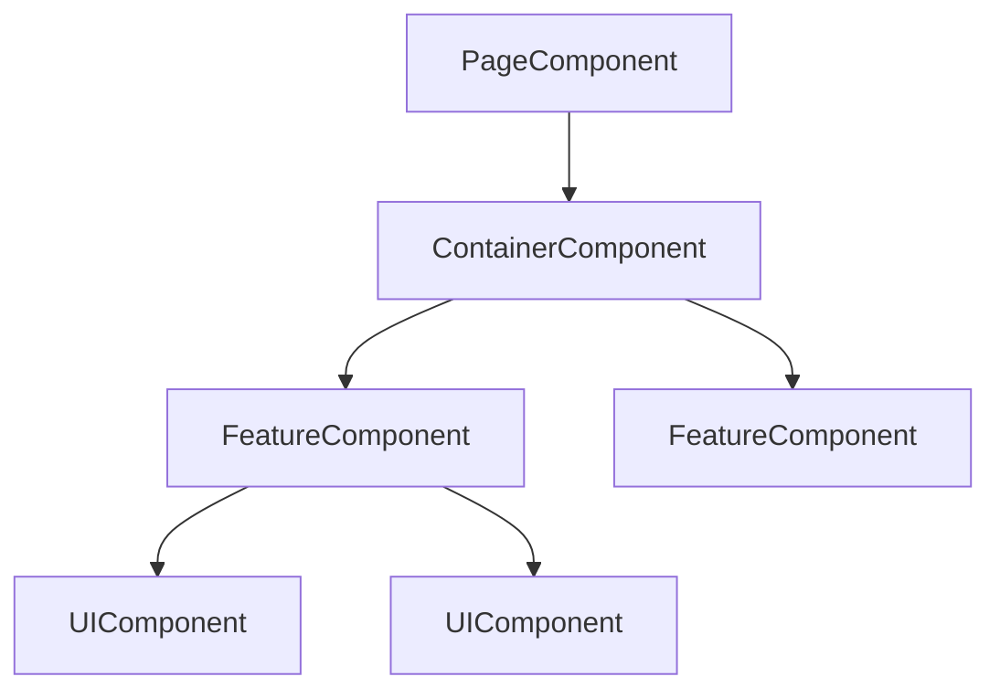

# Create Implementation Plan

Generate detailed, phase-based implementation plans with separate backend and frontend files.

## Prerequisites

This skill works best after the `tech-lead` skill has provided a high-level architecture overview. If no overview exists, gather basic context first.

## Workflow

### 1. Gather Context

Ask user for:
- **Feature requirement**: Description or link to tech-lead output
- **Backend repo path**: Path to API codebase
- **Frontend repo path**: Path to React/Vue/Next.js/Nuxt codebase
- **Output location**: Where to save the implementation plan files

### 2. Deep Code Investigation

For each codebase, investigate thoroughly:

**Backend Investigation**:
1. Identify existing domain structure in `domain/`, `entities/`, `aggregates/`
2. Find related commands/queries in `commands/`, `queries/`
3. Check existing repositories and their patterns
4. Review event handlers and domain events
5. Examine existing services for reusable logic

**Frontend Investigation**:
1. Trace the component tree from page to leaf components
2. Identify existing reusable components that can be extended
3. Review service layer patterns (`services/`, `api/`)
4. Check store structure and state management patterns
5. Examine existing hooks/composables for reuse

### 3. Generate Implementation Plans

Create two separate markdown files:

#### Backend Plan File: `{feature}-backend-plan.md`

```markdown
## Feature: [Name] - Backend Implementation Plan

### Overview
[Brief description of backend implementation approach]

### Domain Analysis

#### Bounded Context
- **Context name**: [e.g., OrderManagement]
- **Related contexts**: [e.g., Inventory, Payment]
- **Context boundaries**: [What this context owns vs. depends on]

#### Domain Model



### Implementation Phases

#### Phase 1: Domain Layer
| Task | File Path | Description |
|------|-----------|-------------|
| Create [Entity] | `src/domain/entities/...` | [Purpose] |
| Define [ValueObject] | `src/domain/value-objects/...` | [Constraints] |
| Create [Aggregate] | `src/domain/aggregates/...` | [Invariants] |

**Reusability notes**:
- [Which entities/VOs can be reused from existing code]
- [New abstractions to create for future reuse]

#### Phase 2: Application Layer (CQRS)
| Task | File Path | Description |
|------|-----------|-------------|
| Create [Command] | `src/application/commands/...` | [Purpose] |
| Create [Query] | `src/application/queries/...` | [Purpose] |
| Create [Handler] | `src/application/handlers/...` | [Logic overview] |

**Event considerations**:
- [Domain events to emit]
- [Event handlers to create]

#### Phase 3: Infrastructure Layer
| Task | File Path | Description |
|------|-----------|-------------|
| Create [Repository] | `src/infrastructure/repositories/...` | [Data access] |
| Add migrations | `src/infrastructure/migrations/...` | [Schema changes] |

#### Phase 4: API Layer
| Task | File Path | Description |
|------|-----------|-------------|
| Create [Endpoint/Resolver] | `src/api/...` | [Request/Response] |
| Add validation | `src/api/validators/...` | [Validation rules] |

### Integration Points
[List endpoints/events that frontend will consume - see references/integration-notes.md]
```

See `references/backend-plan.md` for detailed DDD/CQRS patterns and phase breakdown guidance.

#### Frontend Plan File: `{feature}-frontend-plan.md`

```markdown
## Feature: [Name] - Frontend Implementation Plan

### Overview
[Brief description of frontend implementation approach]

### Component Architecture



### Implementation Phases

#### Phase 1: UI Components (Atomic)
| Component | Path | Props | Reusable |
|-----------|------|-------|----------|
| [Button variant] | `src/components/ui/...` | [Props interface] | Yes |
| [Input variant] | `src/components/ui/...` | [Props interface] | Yes |

**Reusability notes**:
- [Existing components to extend]
- [New atomic components needed]

#### Phase 2: Feature Components
| Component | Path | Responsibility |
|-----------|------|----------------|
| [FeatureCard] | `src/components/features/...` | [What it displays/handles] |
| [FeatureForm] | `src/components/features/...` | [Form handling] |

#### Phase 3: Service Layer
| Service | Path | Methods |
|---------|------|---------|
| [FeatureService] | `src/services/...` | [API methods] |

**API contract**:
- [Endpoints to call - see integration notes]
- [Request/Response types]

#### Phase 4: State Management
| Store/Slice | Path | State Shape |
|-------------|------|-------------|
| [featureStore] | `src/stores/...` | [State interface] |

**Actions/Mutations**:
- [List of actions]
- [Async thunks/effects]

#### Phase 5: Page Integration
| Page | Path | Components Used |
|------|------|-----------------|
| [FeaturePage] | `src/pages/...` | [Component list] |

**Data flow**:
1. Page loads → triggers [action]
2. Store calls [service method]
3. Service fetches from [endpoint]
4. Store updates → components re-render
```

See `references/frontend-plan.md` for detailed component patterns and workflow guidance.

### 4. Generate Integration Notes

Append to both files or create separate `{feature}-integration.md`:

```markdown
## Frontend/Backend Integration

### API Contract
| Endpoint | Method | Request | Response | Frontend Usage |
|----------|--------|---------|----------|----------------|
| `/api/...` | POST | `{...}` | `{...}` | [Which component/service] |

### Events (if applicable)
| Event | Publisher | Subscriber | Frontend Handling |
|-------|-----------|------------|-------------------|
| [DomainEvent] | Backend | Backend/FE | [WebSocket/Polling] |

### Integration Checklist
- [ ] Backend endpoints implemented and tested
- [ ] API types shared/generated
- [ ] Frontend services calling correct endpoints
- [ ] Error handling aligned
- [ ] Loading states implemented
```

See `references/integration-notes.md` for complete integration checklist.

## Output Guidelines

- Generate **two separate files** for backend and frontend
- Each phase should be **independently implementable**
- Include **file paths** for every task
- Mark **reusable components** explicitly
- Use **Mermaid diagrams** for visual clarity
- Keep phases **small and focused** (2-5 tasks each)
- Reference **existing code** that can be reused
